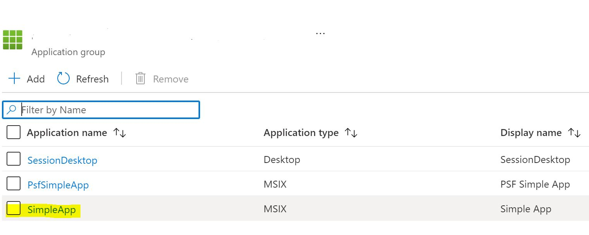

# Azure Virtual Desktop MSIX App Attach operations

## Introduction

[Fast forward -  jump directly to the *Getting started* section](#getting-started)

Azure Virtual Desktop (AVD) introduced lately the [MSIX App Attach](https://docs.microsoft.com/en-us/azure/virtual-desktop/what-is-app-attach) feature, which allows Ops teams efficiently to deploy MSIX packages to the AVD infrastructure. The AVD MSIX App Attach starter ADO pipeline has the goal to provide a workflow automation to create and upgrade an MSIX Package to a new version using MSIX App Attach. Using ADO pipelines will provide Ops teams traceability and operational reliability to manage MSIX packages in AVD. We intentionally kept the process simple so that you can adopt it easily to your specific needs.

The pipeline will support the scenario where the team is getting App binaries for the Application.  They need to be packaged in an MSIX package and deployed to AVD.

If the Team is owning the code and is building the Application as well as packaging the MSIX in an automated way before deploying to AVD. The pipeline could be easily adopted for this scenario by changing the CI stage of the pipeline to integrate with your existing automation.

The following graphic is showing an overview of the key components involved by the second scenario. The pipeline implements a CI and CD stage. The CI stage is getting the App binaries from a Azure Blob. The CD stage deploys the image to the MSIX _AppAttach_File_share (1) and deploys it to the AVD infrastructure (2):


### Pipeline process

**CI Stage** will
1. create a new MSIX package from a zipped Application File structure, which the pipeline takes as input from Azure Blob
2. create an VHDX image containing the MSIX package
3. store the image as an ADO Artifact and makes it available to the **CD stage**

**CD Stage** will
1. copy the VHDX image to the Azure VM, which act as the MSIX _AppAttach_File_share
2. register the new MSIX package in AVD and set it as inactive
3. triggers a manual Approval Gate workflow which allows to set the package active, which triggers the rollout to AVD.

The following graphic is showing the pipeline process structured by the CI stage process steps and the CD stage process steps.


### YAML template structure

The pipeline is using yaml templates to structure the workflow. The following overview is showing templates being used. The main entry point ```ENV-CICD-avd-msix-app-attach.yml``` is considered to be environment specific and so takes all environment specific variables. The sub templates could be easily mapped to the CI/CD stages and are presenting the workflow for each logical set of steps.


Use the following links to learn more details about used patterns and customization :

Pipeline workflow
- [Understand the concept Image_Artifact_Location](doc/image-artifact-location.md) : Image_Artifact_Location is a storage location used by the pipeline for the images. Learn how to customize the behavior.
- [Rollout Orchestration multiple environments](doc/multiple-environments.md) : Many enterprises require rollouts to be orchestrated trough several environments before reaching production. Learn how the pipeline is supporting this requirement.
- [Parallel Beta testing in a single AVD environment](doc/beta_test_env.md) : How to support Beta App Users in parallel within a single AVD environment.

MSIX packaging, Image creation and MSIX App Attach
- [MSIX App Attach Automation](doc/msix-appattach-automation.md) : Learn about the MSIX packaging, image creation and publishing process by the pipline and where to customize if needed.
- [Package Support Framework](doc/psf.md) : Your legacy App is not MSIX compatible and you do not have access to code? Learn about the Package Support Framework and how it could be used in the pipeline to overcome legacy limitations by using PSF configuration.

## Prerequirements

As this project fosters a full MSIX Appattach CI/CD pipeline to Azure Virtual Desktop, there is a set of requirements which are out of scope. However, we present a list of requirements and specific notes are provided:

* **Azure Subscription** : An Azure Subscription is required to host all related AVD related resources;
* **Azure DevOps project** : An Azure DevOps project is required using Azure Repos and Azure Pipelines;
* **Azure Virtual Desktop environment** :
  * There are a set of [Requirements](https://docs.microsoft.com/en-us/azure/virtual-desktop/overview#requirements) for the AVD environment
  * Session Host Pool : There is [tutorial](https://docs.microsoft.com/en-us/azure/virtual-desktop/create-host-pools-azure-marketplace) in AVD documentation.
    * Alternatively, you can also recur to the [AVD ARM based Infrastructure as Code](https://github.com/Azure/RDS-Templates/tree/master/ARM-wvd-templates)
  * Application Group: There is [tutorial](https://docs.microsoft.com/en-us/azure/virtual-desktop/manage-app-groups) in AVD documentation.
* **Azure Active Directory Domain Services (AADDS)** :
* **Azure Storage Account Gen2** :
  * Create Blob container to place application input file (zip). Documentation is available [here](https://docs.microsoft.com/en-us/azure/storage/blobs/.storage-quickstart-blobs-portal)
* **Azure Virtual Machine (fileshare)** : For using the MSIX App Attach feature, a UNC file share is required. In this setup, a common Virtual Machine is set up. Documentation is available [here](https://docs.microsoft.com/en-us/azure/virtual-machines/windows/quick-create-portal).
* **Remote Desktop clients** : Several clients are supported for different OSs and devices. Download the one that suits you, by checking the options [here](https://docs.microsoft.com/en-us/azure/virtual-desktop/overview#supported-remote-desktop-clients).
* **Bash shell** : Having a bash shell (ex:WSL2) in order to run provided `.sh` scripts. The Azure CLI is requried to be installed.

## Getting Started

Once you have all the requirements checked, there will be a an Azure Virtual Desktop infrastructure already setup. This infrastructure also includes some additional Azure resources, hence being a full cloud native setup.


1. If you're familiar with Azure Devops you may prefer to do some of the steps manually. The following tasks are required in order to run this pipeline:

    - Create an Azure Devops project pointing to the repo;
    - Create azure Service connection;
    - Create Azure Devops pipeline pointing to yaml
    - Create Application Variable Group (review and update Variables including secrets)
    - Create Environment Variable Group (review and update Variables including secrets)
    - Create Secure File (certificate)

2. We've also automated part of the initial setup. In order to quickly start, let's configure the Azure DevOps project to run the pipline and deploy the sample application to your AVD infrastructure.

    - Create Azure Devops project pointing to the repo (manual)
    - Review and update bash variables in `/setup/dev-env.sh` (manual)
    - Run the `/setup/setup-azure-devops.sh`
    - Update secrets in Variable Groups (manual)
    - Create Secure File (certificate) (manual)

Let us help you wit a complete walkthrough:

### Setup Azure Devops

**1. Open a bash with `az cli` installed;**

**2. Review/change all the variables in `/setup/dev-env.sh`;**

**3. execute `/setup/setup-azure-devops.sh`.**

  >  This script will execute the following tasks:
  >
  >  - Create the `Variable Groups` used by the pipelines;
  >  - Create `Service Connection(s)` to your Azure Subscription(s);
  >  - Create a `pipeline` in Azure Pipelines (pointing to yaml in `./pipelines/env-CICD-avd-msix-app-attach.yml`);

### Configure the Variable Groups

In your Azure Devops project, go to **Azure Pipelines > Library**. You should have a total of 2 variable groups already created:

- `APP-msix-appattach-vg` : This is an application specific variable group. It should contain information to be used during the MSIX packaging steps.
- `DEV-msix-appattach-vg` : This is an environment (DEV) specific variable group. Contains information about the environment, namelly azure service connection, AVD Session pool name and others. Should be simillar to other environment variable groups.

> **NOTE:** For more information about parameters, variable groups or secure files, check the [Library Management](/doc/images/library-management.md) document.

**4. Review variable values in `APP-msix-appattach-vg`;**

**5. Review variable values in `DEV-msix-appattach-vg`.**

### Configure the Secure file

**6. Create a new secure file in the Azure Devops project;**

  > Add the sample self-signed certificate available in `/msix-appattach/msix_certs/sscert.pfx` as a secure file;
  > You can read how to do it in [Use secure files](https://docs.microsoft.com/en-us/azure/devops/pipelines/library/secure-files?view=azure-devops).

### Configure and run the CI/CD pipeline

The pipeline is expecting an app zip file in a Blob Storage.

**7. Copy the `/application/appbin.zip` to a reachable blob container in the Blob storage account.**

Now you're aready to run the pipeline using a Windows based Hosted Agent. The pipeline accepts parameters that must match you environment.

**8. Run the created pipeline (default name shoud be `env-CICD-AVD-msix-app-attach`);**

**9. Fill all the parameters accordingly to your environment;**


  > **NOTE:** you can directly change and commit the main YAML pipeline `/.pipelines/env-CICD-avd-msix-app-attach.yaml` and change the parameters default values.

**9. Once the pipeline is successfully executed, check your AVD environment;**

  >  Check your MSIX Pachages in the AVD host pool resource

**10. Add the new app in an existing Application Group with respective assingments;**

  > Go to your AVD Host pool resource and open `Application Groups` and select a application group;
  > Click in `Applications (manage)` and add a new Application;
  > Specify recently deployed `MSIX Package` and optionally fulfill the `Display Name` and `Description`
  > Documentation is available in article [Manage app groups with the Azure portal](https://docs.microsoft.com/en-us/azure/virtual-desktop/manage-app-groups).



In this image we see an example with the `GoogleChrome` app registered in an application group.

**11. Sign-in into one of the session hosts and run the deployed application;**

## References

* [What are the top methods to deploy a Windows Virtual Desktop Host Pool](https://cloudblogs.microsoft.com/industry-blog/en-gb/cross-industry/2020/03/17/what-are-the-top-methods-to-deploy-a-windows-virtual-desktop-host-pool/)
* [Enterprise-scale support for the Windows Virtual Desktop construction set](https://docs.microsoft.com/en-us/azure/cloud-adoption-framework/scenarios/wvd/enterprise-scale-landing-zone)
* [Azure Virtual Desktop QuickStart](https://techcommunity.microsoft.com/t5/azure-virtual-desktop/introducing-the-windows-virtual-desktop-quickstart/m-p/1589347)
* [Building a Windows 10 Enterprise Multi Session Master Image with the Azure Image Builder DevOps Task](https://techcommunity.microsoft.com/t5/azure-virtual-desktop/building-a-windows-10-enterprise-multi-session-master-image-with/m-p/1503913)
* [Azure Virtual Desktop](https://docs.microsoft.com/en-us/azure/virtual-desktop/faq)
* [MSIX app attach FAQ](https://docs.microsoft.com/en-us/azure/virtual-desktop/app-attach-faq)
