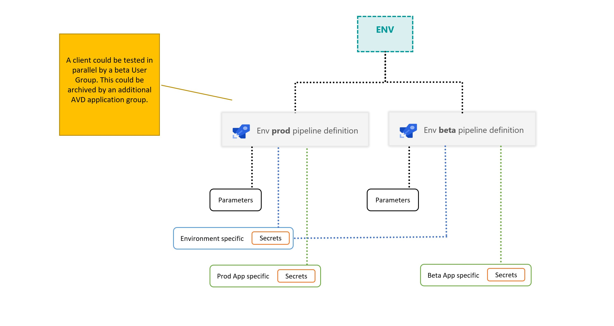

# Parallel Beta testing in a single AVD environment

A common pattern for Beta testing is to rollout a second App in parallel for a defined set of users. AVD supports this scenario, so that just one AVD environment is needed. 



- In the AVD configuration a separate Application group needs to be created for the Beta App
- Beta users will be assigned to the new Application group
- A second pipeline definition will be created for the Beta App
- The pipeline is referencing a App variable group containing like ```APP-beta-msix-appattach-vg``` containing the Beta App specific variables

As a result we will have two sperate pipelines to package and deploy the
1) Production App
2) Beta App