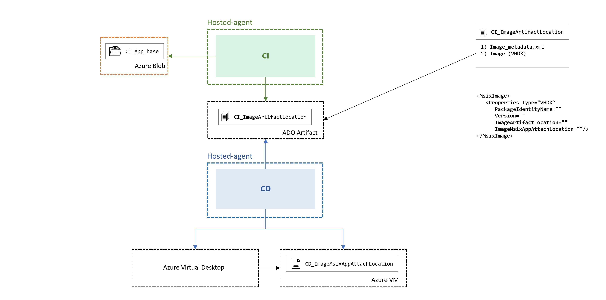

# Image Artifact Location

The Image_Artifact_Location is an intermidiate location where the CI stage is storing the created image artifacts. The CD stage pulls the artifacts from the location and will take care of the deployment to the AVD infrastructure.

We will store the actual ```Image``` and a ```Image_metadata.xml``` file in the Image_Artifact_Location. ```Image_metadata.xml``` is containing additional metadata of the ```Image``` which is being used by the pipeline logic.

   ```xml
 <MsixImage>
    <Properties Type="VHDX"
      PackageIdentityName="" 
      Version="" 
      ImageArtifactLocation="" 
      ImageMsixAppAttachLocation=""/>
</MsixImage>
   ```

The starter pipeline is using Azure Artifacts as Image_Artifact_Location. This way all pipeline executions will have the created assets accessible from the execution reports for full traceability. 
 


Please review the 
[Azure Artifacts](https://docs.microsoft.com/en-us/azure/devops/artifacts/start-using-azure-artifacts?view=azure-devops#billing-and-free-monthly-usage)
documentation for Azure Artifacts setup and billing details.

If you have to work with huge image sizes or you have different requirements in regards to the storage, you might want to use a different storage type as Image_Artifact_Location. You can change this easily by adopting the pipeline.

## Using an external storage for the image

To change from Azure Artifacts to an external storage like Azure Blob as Image_Artifact_Location, you have do some updates to the CI- and CD-stage. The same applies for other storage types as well. The following graphic shows the proposed scenario. 


Please note that we recommend to keep ```Image_metadata.xml``` as Azure Artifact to leverage the same logic. To adopt this scenario you have to:

**Update the CI stage** in ```CI-msixPackaging-steps.yaml```
1) replace the publish task  ```ARTIFACT Msix AppAttach Image``` with a task to store on Azure Blob like the AzureFileCopy task
2) change the task ```UPDATE Image Metadata``` to store the correct ```MsixImage.Properties.ImageArtifactLocation``` returned by 1)

**Update the CD stage** in ```CD-imagePublish-steps.yaml``` 
1) read from ```Image_metadata.xml``` to get the image location. Use the image location as input for the replacement task of ```GET Image Artifact```
1) replace the download task ```GET Image Artifact``` with a task to read from Azure Blob. Make sure you save the image on the hosted agent at ```$(Pipeline.Workspace)/Image/``` 