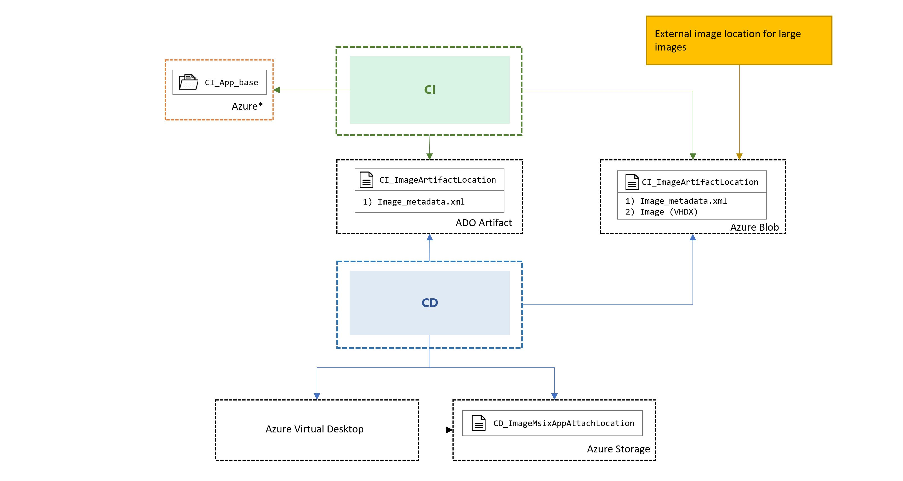

# Image Artifact Location

The pipeline is using a CI- and CD-stage. The CI stage is building the image and CD stage takes care of the deployment. The starter pipeline CI is using ADO Artifacts to store the created image. CD is pulling the image from ADO artifacts. We also added an ```Image_metadata.xml``` to store meta information about the image as well. This way all pipeline executions will have the created assets available in the report for full traceability. This concept also provides an easy way to change to an external storage in case you do not want to use ADO artifacts - see extended scenario for details.


## Extended scenario 

If you prefer an external storage as Image_Artifact_Location like Azure Blob because you have  to work with huge image sizes you can leverage 
the ```Image_metadata.xml``` to get in CD the correct image location.



To adopt this scenario you have to update the CI stage in ```CI-msixPackaging-steps.yaml```:
1) replace the publish task  ```displayName: ARTIFACT Msix AppAttach Image``` with a task to store on Azure Blob like the AzureFileCopy task
2) change the task ```displayName: UPDATE Image Metadata``` to store the correct ```MsixImage.Properties.ImageArtifactLocation``` returned by 1)

Update the CD stage in ```CD-imagePublish-steps.yaml``` :
1) replace the download task ```displayName: GET Image Artifact``` with a task to read from Azure Blob. Make sure you save the image on the hosted agent at ```$(Pipeline.Workspace)/Image/``` 
