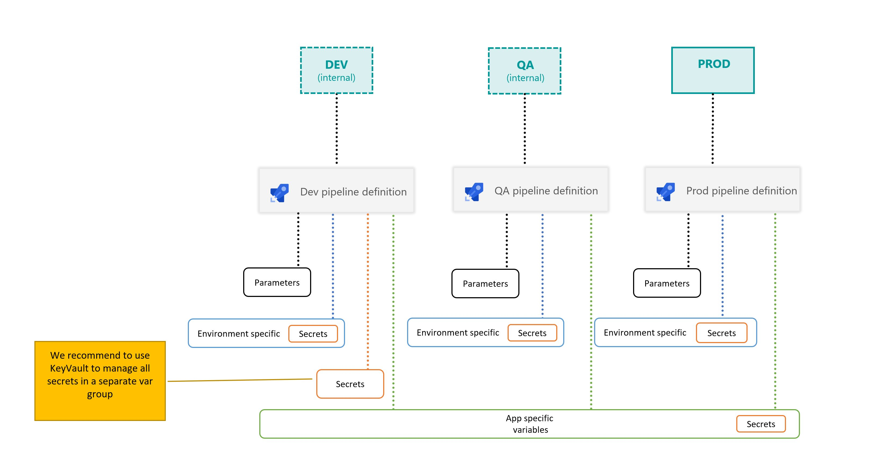

# Rollout Orchestration multiple environments

This repo includes a single pipeline `/.pipelines/env-CICD-avd-msix-app-attach.yaml` executing both a Continuous Integration (CI) stage and a Continuous Delivery (CD) stage to a single environment. The default name used is `DEV`.

In order to support multiple environments (ex: **DEV**, **QA**, **PROD**) there are several ways to implement it. Accordinngly to each organization requirements the best method is determined.

In this scenario, we're focusing on enterprises looking to deploy legacy applications in a modern Azure Virtual Desktop infrastructure. It can happen that even the source code of the application is not available, which determines the method used to build the MSIX package (in CI).

However these enterprises, still manage multiple environment, hence it is critical to support several environments in this process.
Aiming for simplicity in this process, a way to support multiple environments is:

**1. Create multiple YAML pipeline in the repo, each targeting a specific environment**
  
  - The pipeline name can contain the environment it is targeting. Ex: **PROD**-CICD-AVD-msix-app-attach
  - There is flexibility to customize each environment process by changing the YAML pipeline file
  - New teamplate files can be created and referenced by the YAML pipeline
  - Reportability is easy to use and trackability becomes simple

**2. Change the reference to the environment specific variable group**

  - Variable group were created for each envirnment
  - In the variable group name, the invironment is identified
  - The referece to the environment specific variable groups can be found [here](https://github.com/joalmeid/avd-app-attach-ops/blob/mvp1/.pipelines/env-CICD-avd-msix-app-attach.yml#L61).

**3. Customize each YAML pipeline with the specific environment name**

  - Default environment name can be changed [here](https://github.com/joalmeid/avd-app-attach-ops/blob/mvp1/.pipelines/templates/CD-msix-stage.yaml#L5)
  - A parameter can be set when calling the [CD-msix-stage](https://github.com/joalmeid/avd-app-attach-ops/blob/mvp1/.pipelines/env-CICD-avd-msix-app-attach.yml#L103). Ex: Adding the line `envId: PROD` in the root YAML pipeline.

> There is also the possibility to leverage [Multi-stage pipelines](https://docs.microsoft.com/en-us/azure/devops/pipelines/get-started/multi-stage-pipelines-experience?view=azure-devops).

## Variable Groups

In a multi environment setup, the variable group usage becomes trivial. In each environment specific YAML pipeline, it is recommended to link the pipeline by referencing an environment specific variable group.

In this diagram, we can understand that each pipeline will use its own set of variable groups. For *environment specific* configuration it is possible to provide specific values to each seperate variable group. Each pipeline will execute in its own environment.
Additionally, the *Application Specific* variable groups are shared, making sure the same values are used across environments. Same happens to *parameters* and respective default values, as they can be customized by environment.

The environment specific variable groups can be edited in the YAML pipeline file, [here](https://github.com/joalmeid/avd-app-attach-ops/blob/mvp1/.pipelines/env-CICD-avd-msix-app-attach.yml#L61)
