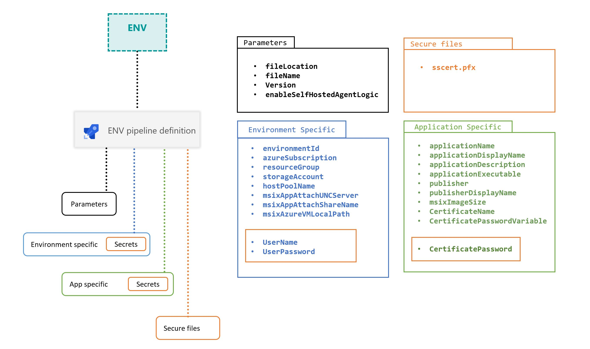

# Library Management

In the pipeline a set of configurable data are provided. The pipeline allows one to customize **parameters**, **secure files** and **variable groups**, wich are devided into *environment specific* variables and *application specific* variables.

## Parameters

The pipeline allows to set parameters for each execution. The elected parameters were choosen by relevance in the process. It covers inputs (fileLocation and fileName), version and output location (msixAppAttachUNCPath). Here follows a parameter description:

| Name | Description |
|------|-------------|
| **fileLocation** | The SAC file location path Expected to be reachable through http/https protocol for direct download |
| **fileName** | SAC file name for a particular release |
| **version** | Application version (semantic version is recommended) to be used in the AVD deployment |

## Variable Groups

Here are the complete set of variables used in the pipeline:

### Application Specific Variables

| Name | Description |
|------|-------------|
| **applicationName** | App name to be used in the AVD deployment |
| **applicationDisplayName** |App display name to be used in the MSIX package to be deployed in the AVD environment |
| **applicationDescription** |App description to be used in the MSIX package to be deployed in the AVD environment|
| **applicationExecutable** | App full executable path in the in the MSIX package. Corresponds to the main app entry point |
| **publisher** | MSIX Package certificate publisher. Typically follows the syntax "CN=Contoso Software, O=Contoso Corporation, C=US" |
| **publisherDisplayName** | MSIX Package certificate publisher display name |
| **msixImageSize** | Maximum MSIX image size to be used in the VHD/CIM image format. Must be enough to include full app |
| **CertificateName** | The certificate file name to sign the MSIX Package |
| **CertificatePasswordVariable** | Name of the variable referencing the secure variable containing the password used by MsixSigning@1. Default: CertificatePassword |
| **CertificatePassword** | Containing the certificate password |

### Environment Specific Variables

| Name | Description |
|------|-------------|
| **azureSubscription** | The name of a Service Connection of type Azure Resource Manager in the ADO organization |
| **resourceGroup** | Resource group where the Azure Virtual Desktop resource are created |
| **storageAccount** | Storage account where the CI_App_base will be copied from and used by the AzureCopyTask@4 |
| **hostPoolName** | Session host pool resource name in the Azure Virtual Desktop infrastructure |
| **msixAppAttachUNCServer** | UNC Server FQDN to publish MSIX App Attach image. Used with variable msixAppAttachShareName |
| **msixAppAttachShareName** | UNC Share name to publish MSIX App Attach image. Used with variable msixAppAttachUNCServer |
| **msixAzureVMLocalPath** | The Azure VM local path, where the UNC Share is configured. Needed by the AzureFileCopy@4 task. Not used for the Azure NetApp files scenario.
| **UserName** | Name of the Azure VM Admin User, valid Domain User for the Azure NetApp scenario|
| **UserPassword** | Password of the Azure VM Admin User, valid Domain User for the Azure NetApp scenario |

## Secure files

In order to sign the MSIX package created, the pipeline leverages the task [MsixSigning](https://docs.microsoft.com/en-us/windows/msix/desktop/msix-packaging-extension?tabs=yaml#msix-package-signing). This signing task allows signing using a certificate. In the implemented pipeline, the certificate comes from the [Secure Files library](https://docs.microsoft.com/en-us/azure/devops/pipelines/library/secure-files).

> This task also supports providing the certificate as an encoded string. For example after fetching it with the [Azure Key Vault task](https://docs.microsoft.com/en-us/azure/devops/pipelines/tasks/deploy/azure-key-vault).
