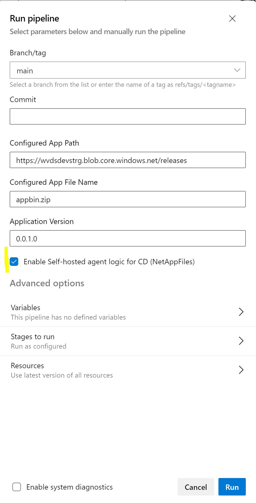

# Azure NetApp Files (ANF)

In the context of MSIX App Attach feature in Azure Virtual Desktop (AVD), the location for the MSIX images requires a UNC Share. Specially for enterprise-grade organizations, aiming for higher performance, [Azure NetApp Files (ANF)](https://docs.microsoft.com/en-us/azure/azure-netapp-files/azure-netapp-files-introduction) is a great option. This integrates seamleslly with AVD MSIX App Attach, while leveraging ANF beneficies.

Azure NetApp Files is a high-performance, metered file storage service from Azure. It supports several workload types and is highly available by default. It also offers service and performance levels as well as snapshot capabilities. Specifically for Azure Virtual Desktop, it is recommended for large scale deployments.

It is important to understand the Azure NetApp Files Service levels, in order to best suit your performance and/or cost needs. Check it [here](#azure-netapp-files-service-levels).

> [FSLogix](https://docs.microsoft.com/en-us/fslogix/overview), another roaming profile technology can also beneficiate from Azure NetApp Files. You can check additional documentation in the article [Create a profile container with Azure NetApp Files and AD DS](https://docs.microsoft.com/en-us/azure/virtual-desktop/create-fslogix-profile-container).

## Setting up Azure NetApp Files for MSIX App Attach

Here, the main goal is to add MSIX Packages on a AVD host pool relying on Azure NetApp Files, an enterprise-grade SMB volumes. We will guide you through the steps to set up Azure NetApp Files for MSIX App Attach.

> At the time of writing, Azure NetApp Files usage required submiting a waitlist request. You can refer to [Register for Azure NetApp Files](https://docs.microsoft.com/en-us/azure/azure-netapp-files/azure-netapp-files-register).

### Prerequirements

We enumerate the ANF prerequisites accordingly to our scenario. Check additional initial [prerequisites](../README.md#prerequirements)

- Azure account with contributor or administrator privileges on the subscription
- Ensure the VNet or subnet where AADDS is deployed is in the same Azure region as the Azure NetApp Files deployment.
- It will be required to delegate a subnet to Azure NetApp Files.

### Walkthrough the Azure NetApp Files for AVD MSIX App Attach

> First things first: Confirm Azure NetApp Files is available in the region of your session hosts.

We've automated the Azure NetApp Files setup. By using Azure CLI and the `netappfiles` module In order to quickly start, let's configure the Azure DevOps project to run the pipline and deploy the sample application to your AVD infrastructure.

**1. Open a bash with `az cli` installed;**

**2. Review/change all the variables in `/setup/avd-env.sh`;**

**3. Execute `/setup/create-netapp.sh`.**

  >  This script will execute the following tasks:
  > 
  >  - Register the NetApp Resource Provider
  >  - Set up an Azure NetApp Files account
  >  - Create a capacity pool
  >  - Join an Active Directory Connection
  >  - Create a delegated subnet
  >  - Create a new volume
  >  - Take a note of the mount path based on the provisioned NetApp volume

**4. Validate that all your AVD session hosts can reach the created volume and mount path**

**5. Configure the Azure Devops pipeline to publish to the Azure NetApp Files Share**

- Configure an Azure DevOps Self-hosted Agent in the same VNET as the ANF volume
- Update variables in the Environment specific variable group:

| Action | Name | Description |
|--------|------|-------------|
|add| **devOpsAgentPool** | Azure DevOps Self-hosted agent pool name  |
|update| **msixAppAttachUNCServer** | Use the FQDN in the NetApp Mount path  |
|update| **msixAppAttachShareName** | Use the UNC share path in the NetApp Mount path |
|update| **UserName** | Set a domain user with the format `domain\username`|
|uddate| **UserPassword** | Set a domain user password |

> **Tip:** If you switch between the AzureVM and the Azure Net App Files scenario it could be handy to create a second Environment specific variable group. The Variable group name is defined in `env-CICD-avd-msix-app-attach.yml`

**6. Run the pipeline** 

the pipeline can switch between the AzureVM and the Azure Net App Files scenario by setting the parameter `Enable Azure NetApp Files logic = true`

> **Tip:** If only the Azure Net App Files scenario is used. The default value of `Enable Azure NetApp Files logic` can changed in `env-CICD-avd-msix-app-attach.yml`

## Azure NetApp Files Service Levels

Azure NetApp Files Servic Level is a capacity pool attribute. During our provisioning we set it when creating the capacity pool. YOu can check it [here](https://github.com/joalmeid/avd-app-attach-ops/blob/b216427cd1056c0e7543e9c71e46062cbd981a25/setup/create-netapp.sh#L25).

This service offers you performant throughput limit through a set of conditions:

- Capacity pool service level (**Standard**, **Premium**, **Ultra**)
  - Respectively **16 MiB/s**, **64 MiB/s** or **128 MiB/s** of throughput per 1 TiB
- The quota assigned to the volume
  - Scales linearly with the service level. Depending on quota defined compared with 1 TiB for that specific service level
- The QoS type (auto or manual) of the capacity pool
  - Manual QoS capacity pool allows you to assign the capacity and throughput for a volume independently

For more information, check the [Service levels for Azure NetApp Files](https://docs.microsoft.com/en-us/azure/azure-netapp-files/azure-netapp-files-service-levels) documentation article.

## References

- [Setting up Azure NetApp Files for MSIX App Attach | TechCommunity Step-by-Step Guide](https://techcommunity.microsoft.com/t5/azure-virtual-desktop/setting-up-azure-netapp-files-for-msix-app-attach-step-by-step/m-p/1990021)
- [Guidelines for Azure NetApp Files network planning](https://docs.microsoft.com/en-us/azure/azure-netapp-files/azure-netapp-files-network-topologies)
https://docs.microsoft.com/en-us/azure/azure-netapp-files/create-active-directory-connections#decide-which-domain-services-to-use
- [Solution architectures using Azure NetApp Files](https://docs.microsoft.com/en-us/azure/azure-netapp-files/azure-netapp-files-solution-architectures#virtual-desktop-infrastructure-solutions)
- [Create and manage Active Directory connections for Azure NetApp Files](https://docs.microsoft.com/en-us/azure/azure-netapp-files/create-active-directory-connections#decide-which-domain-services-to-use)

- [FAQs About Azure NetApp Files](https://docs.microsoft.com/en-us/azure/azure-netapp-files/azure-netapp-files-faqs)