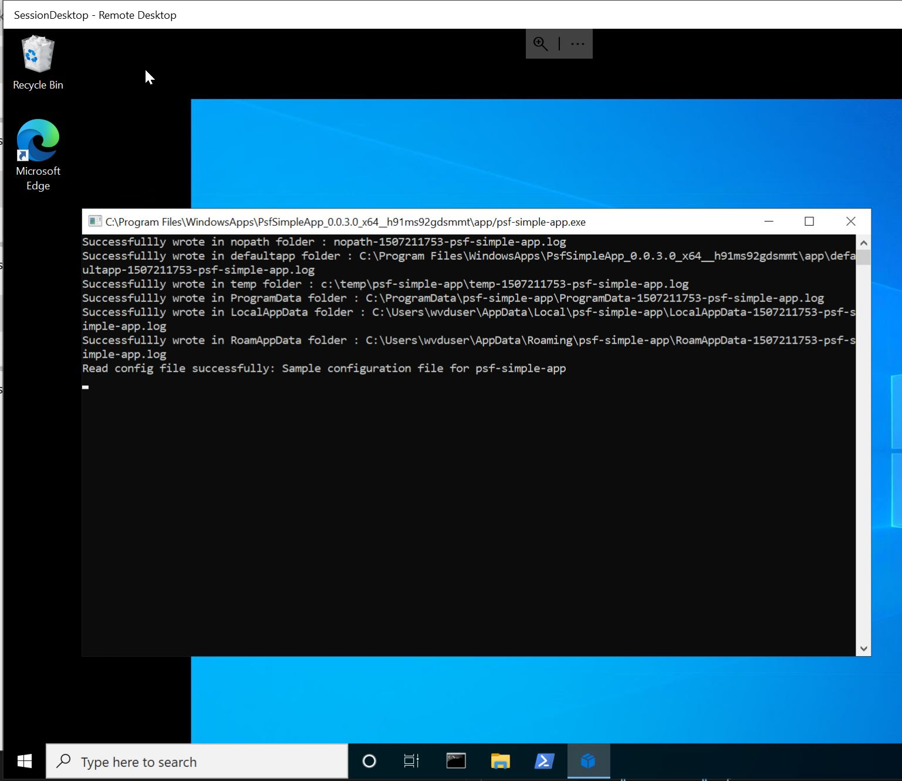

# Package Support Framework

The [Package Support Framework (PSF)](https://github.com/microsoft/MSIX-PackageSupportFramework) is an open source kit that helps applying fixes to an existing desktop application, specially when there is no  access to the source code. End goal is to run the application in an MSIX container.

Most common use cases to use PSF are:

- Appication can't find some DLLs when launched.
- You may need to set your current working directory.
- Having `ACCESS DENIED` due to appplication writes to the install folder.
- Your app needs to pass arguments to the executable when launched.

To get you started with PSF we have added an app which requires PSF integration to work properly in an MSIX container. The app is writing a logfile to the rootfolder which is not working in the MSIX container. The required PSF artifacts are part of the repo:

-  `src/psf-simple-app` contains the psf-sample source for review
-  `application/psf-appbin.zip` is the compiled psf-simple-app.exe to use as pipeline input
-  `msix-appattach/psf_application_artifacts`  contains the binarires required for PSF and the `config.json` defining the PSF configuration for the psf-simple-app.exe

## Enable the PSF sample in the pipeline
- in  `env-CICD-avd-msix-app-attach.yml` toggle the global variable `psfEnabled = true`
- update values in the `APP-msix-appattch-vg` variable group: 

| Name | Value |
|------|-------------|
| **applicationName** | PsfSimpleApp |
| **applicationDisplayName** |PSF Simple App |
| **applicationDescription** |PsfSimpleApp|
| **applicationExecutable** | app\psf-simple-app.exe
    
- use as input for the pipeline `application/psf-appbin.zip`
- run the pipeline and run PSF Simple App on the remote desktop:



## Understanding the PSF sample configuration

The process to use PSF while building an MSIX package is as follows. We included this all steps in pipeline. For your Application you need to customize the PSF `config.json` as needed.

1. **Identify the runtime fix** that solves the detected issue in the msix package.
   * Find available fixups in [PSF github](https://github.com/Microsoft/MSIX-PackageSupportFramework)
2. Get the Package Support Framework files
   * Run `nuget install Microsoft.PackageSupportFramework` and extract relevant files.
   * All the files you need will be under the /bin folder.
   * Files shoud be:
     * PSFLauncher64.exe / PSFLauncher32.exe
     * PSFRuntime64.dll / PSFRuntime32.dll
     * PSFRunDll64.exe / PSFRunDll32.exe
     * FileRedirectionFixup64.dll / FileRedirectionFixup32.dll (if used)
     * TraceFixup64 / TraceFixup32 (if used)
     * WaitForDebuggerFixup64 / WaitForDebuggerFixup32 (if used)
3. Modify the package manifest so the entrypoint is the `PSFLaucher64.exe` or `PSFLaucher32.exe` depending on app processor architecture. 
   >**Note:** the pipeline is doing this for you defined in  `env-CICD-avd-msix-app-attach.yml` by the global variable `psfExecutable = PSFLaucher64.exe` 

   ```xml
    <Applications>
      <Application Id="PsfSimpleApp" Executable="PSFLauncher64.exe" EntryPoint="Windows.FullTrustApplication">
      ...
      </Application>
    </Applications>
   ```

4. Create a configuration file name `config.json` in the root folder. Modify the configuration values accordingly. For the sample application the following config was used:

   > PSF allows defining a config in **xml format**.

   ```json
    {
      "applications": [
          {
              "id": "PsfSimpleApp",
              "executable": "app/psf-simple-app.exe",
              "workingDirectory": "app/"
          }
      ],
      "processes": [
          {
              "executable": "psf-simple-app",
              "fixups": [
                  {
                      "dll": "FileRedirectionFixup.dll",
                      "config": {
                          "redirectedPaths": {
                              "packageRelative": [
                                  {
                                      "base": "app/",
                                      "patterns": [
                                          "psf-simple-app.config",
                                          ".*\\.log"
                                      ]
                                  }  
                              ]     
                          }
                      }
                  }
              ]
          }
      ]
    }
   ```

5. Package the MSIX, using the identified process (leveraging `makeappx.exe`) and test the app.

## References

The Package Support Framework (PSF), allows more advanced scenarios and debugging / troubleshooting techniques. The following documentation is recommended:

* **[Apply runtime fixes by using the Package Support Framework](https://docs.microsoft.com/windows/uwp/porting/package-support-framework):** This article provides step-by-step instructions for the main Package Support Framework workflows.
* [File Redirection Fixup](https://github.com/Microsoft/MSIX-PackageSupportFramework/tree/master/fixups/FileRedirectionFixup) redirect attempts to write or read data in a directory that isn't accessible from an application that runs in an MSIX container.
* [Run scripts with the Package Support Framework](https://docs.microsoft.com/windows/msix/psf/run-scripts-with-package-support-framework): This article demonstrates how to run scripts to customize an application dynamically to the user's environment after it is packaged using MSIX.
